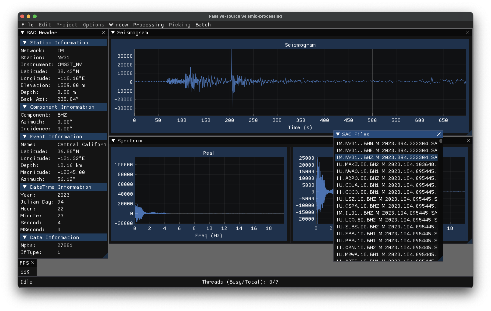

# Passive-source Seismic-processing (PsSp)



The purpose of this is to provide an OS-independent, graphical, seismic-processing software package targeted at passive-source seismologists.

---

## Why does this exist?
### Summary

The purpose can be summarized as **extending the productivity suite of the seismologist**. Seismologists have their program for writing manuscripts
(e.g. MS Word, LaTeX), their program for giving scientific presentations (e.g. MS Powerpoint, Impress Presentation, etc.), their
program for handling emails (Outlook, Thunderbird, whatever). The gap that exists is **what program do they use to do seismic anlaysis**? Far too often,
it is whatever they manage to cludge together, so long as it *seems* to work.

### Introduction

Despite the various seismological tools that exist (and honestly, because of how they are designed) the seismologist will **most likely** need to code 
their own tool(s) (as a shell script stitching programs together, as a Python script using ObsPy, as a SAC macro, etc.). While the ability to do that if it is 
desired by the researcher is awesome, the need to do it is unfortunate as not everyone wants to (or knows how to) write their own codes. It gets worse when you consider the performance of these codes, or how the codes end up becoming obsolete after a short time (try using someone's old Python scripts, or Matlab codes, have them not work and be stuck trying to figure out what is wrong instead of making progress on your research).

### Discussion

The primary issues that I see today are:
1) There are a lack of tools available to the seismologist that have a graphical user interface (GUI).
2) Often tools only do one or a few jobs. This makes life easier for the developer (following the [KISS philosophy](https://en.wikipedia.org/wiki/KISS_principle)),
but it makes life harder for the end-user. Often the end-user needs to stitch/cludge together different tools, developed
by different persons/groups, in order to perform a given research task. Add in the additional complication of OS-exclusive software, locking user's
of the wrong operating system out from certain tools and you have a tremendously unfortunate mess.

The problem is magnified when you consider that often the end-user doesn't necessarily know how to use the tool, nor the underlying
assumptions, nor the limitations. Often, these tools were never designed to be shared and therefore are designed in a non-intuitive fashion, with virtually no
comments in the actual code. These tools are often not documented (or under-documented, or even *incorrectly documented*), they tend to be assumed as just plain *obvious*, despite that being entirely dependent upon a very specific (and undocumented) workflow. These issues tend to be discovered after much confusion and frustration (hopefully fairly early on, as opposed to while writing a manuscript). That is not how science should work.

The disconnected nature of the typical seismic workflow leads to reproducibility issues. A researcher must keep track of every step taken in the analysis manually,
without error. This is easy when a research task is a straight line. However, when there is back-tracking, iterative analysis with minor tweaks, abandoned lines of
exploration, and so on, it becomes exceedingly difficult to be able to provide an accurate account of the actual processing steps necessary to consistently reproduce presented/published results. In this age of modern computing, it is simply **absurd** that the seismologist has no other choice than to work with this *severe tool-deficit*.

The researcher shouldn't need to expend immense amounts of time/energy/mental-bandwidth on making their tools, nor on making them work together. They should be focused on doing science. While advances in machine learning are allowing the modern seismologist to parse massive amounts of data with little effort, we must still look at our data and question the validity of our analysis/interpretation.

### Purpose

PsSp is being developed to solve this problem; to empower the seismologist with tools that are easy to use and foster exploration.
By enabling the scientist to do exploratory analysis quickly, easily, iteratively, and visually, I hope to allow the end-user to improve their
intuitive understanding of what they are doing with their data so that they can make an informed descision of how best to proceed
with their analysis. I hope this will also make entry into seismology easier (undergrads, summer interns, new graduate students, etc.) and
will make it easier for more-seasoned seismologists to use newer and more advanced tools, thus improving everyone's workflow and
the quality of research that is accomplished while minimizing the amount of time (and frustration) devoted to simply trying to get a functional workflow.

---
## Current status

This is extremely early in development.

### Current Focus: Projects

User projects are currently being implemented. This will allow users to have distinct projects that: 
1) Protect their original data sources
2) Have a degree of crash-safety (via auto-save) 
3) Keep user defined program settings (window locations, sizes, etc.)
4) Keep logs of project execution
5) Allow users to maintain project notes
6) Facilitate integrating new data into an existing project
7) Maintain necessary data provenance for publicatons
8) Provide project check-pointing features to ease the challenges of iterative exploratory analysis.
9) Allow making spinning off sub-projects for tangential exploration.

---

## ToDo

See the Todo list at the top of the [main.cpp](/src/code/main.cpp) file for more info on what is going on/planned for the future.

---

## Dependencies

Dependencies that are marked as 'Git submodule' are handled automatically. Other packages must be installed via your package manager of choice
or manually. For those other packages I provide installation guidance for MacOS and Linux systems [here](#compilation-instructions).

The other dependencies are setup as Git submodules and handled automatically.

Info on dependencies:
 * [Dear ImGui](https://github.com/ocornut/imgui/tree/v1.89.5) v1.89.5
    * This provides the OS-independent GUI.
    * Git submodule.
 * [ImGuiFileDialog](https://github.com/aiekick/ImGuiFileDialog), Lib_Only branch
    * This adds OS-independent File Dialogs to Dear ImGui.
    * Git submodule.
 * [ImPlot](https://github.com/epezent/implot).
    * This adds OS-independent plotting functionality to Dear ImGui.
    * Git submodule.
 * [sac-format](https://github.com/arbCoding/sac-format)
    * This provides binary SAC-file (seismic) I/O, both low-level functions and the high-level SacStream class.
    * Git submodule.
 * [OpenGL3](https://www.opengl.org/)
    * This is a graphical backend for the GUI.
 * [GLFW3](https://www.glfw.org/)
    * This is a graphical backend for the GUI.
 * [FFTW3](https://www.fftw.org/)
    * This is necessary for spectral functionality (FFT, IFFT).
 * [MessagePack](https://msgpack.org/)
    * Provides data-serialization, for user project settings.
 * [Boost](https://www.boost.org/)
    * Required by MessagePack

---

## Compilation instructions

I test this on M1 MacOS (Ventura 13.3.1 (a)), as well as on x86_64 Linux (Specifically Ubuntu 22.04).

You'll need to install FFTW3 and GLFW yourself. I believe GLFW provides/includes OpenGL.

**Note** I do not, currently, have a Windows system to test on. I suspect you'll want to use something along the lines of (in no particular order) [WinGet](https://github.com/microsoft/winget-cli), [Scoop](https://scoop.sh/), [vcpkg](https://vcpkg.io/), [Chocolatey](https://chocolatey.org/), or [Cygwin](https://www.cygwin.com/)
to setup your compilation environment on Windows.

---
### MacOS
Using [Homebrew](https://brew.sh/)
```shell
brew install fftw glfw msgpack-cxx
```

**NOTE** For MacOS user's, if you want a stand-alone Application (PsSp.app, no need to execute from the terminal) there are
additional requirements. Please see the [additional instructions](#special-macos-application)

### Linux (Ubuntu 22.04/Debian based)
```shell
sudo apt install libfftw3-dev libglfw3-dev libboost-all-dev libmsgpack-dev
```
---
Next you need to clone this project and initialize the [submodules](submodules)
```shell
git clone https://github.com/arbCoding/PsSp.git
cd PsSp
git submodule update --init
```

That will download the appropriate submodule dependencies, with the correct commit version, automatically, from their respective GitHub repositories.
You can confirm that by examining them inside the submodules directory (they will be empty before you initialize them and populate afterward).

**NOTE** if a submodule is not the correct version (detached head, but submodule was updated)
From the base git dir (PsSp) run
```shell
git submodule update --init --remote submodules/
```

Then it is a simple as running
```shell
make
```
To make PsSp, which will be inside the ./bin/ directory.

---
### Tests
To make the test programs (test programs will go inside the ./bin/test/ directory) run
```shell
make tests
```
---
### Cleanup
To cleanup (including removing the compiled programs), run:
```shell
make clean
```
---

## Special MacOS Application

If you want a stand-alone MacOS application file, there are additional steps.

I do not take credit for figuring this out, I found this [blog post](https://newbedev.com/building-osx-app-bundle) on the topic.

First, I use [dylibbundler](https://github.com/auriamg/macdylibbundler/) to handle rebinding
the links for the non-standard dynamically linked libraries. The application bundle requires that they
be included in the application (such that user doesn't need to install them).

This can be installed via Homebrew
```shell
brew install dylibbundler
```

You can see which dylib's will need to be modified via the `otool` command after the program is compiled:
```shell
otool -L ./bin/PsSp
```

Anything not listed in `/System/Libary/` or `/usr/lib` will need to be included with the application.
Fortunately, **dylibbundler** can handle that for us.
```shell
dylibbundler -s /opt/homebrew/lib/ -od -b -x ./PsSp.app/Contents/MacOS/PsSp -d ./PsSp.app/Contents/libs/
```

Of course, this is implemented automatically in the [Makefile](Makefile), assuming you also used Homebrew to install the other packages (non-Git submodules).

---
For more details, checkout the [Makefile](Makefile). It is heavily commented to make it more accessible.
---
