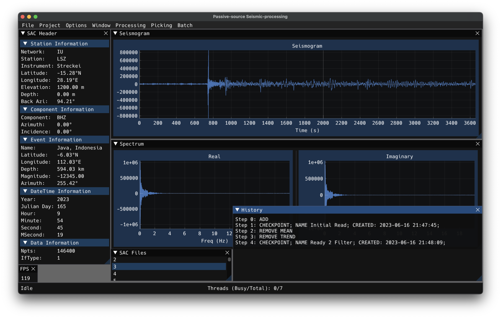

# Passive-source Seismic-processing (PsSp)



PsSp aims to provide an OS-independent, graphical, seismic-processing software package targeted at passive-source seismologists.

## Why does this exist?
### Summary

The purpose of this project is to **extend the productivity suite of the passive-source seismologist**. There exist great tools for writing manuscripts (e.g. MS Word, LibreOffice, LaTeX, ...). There exist great tools for creating presentations (e.g. MS Powerpoint, Impress Presentation, ...). There exist great tools for communicating with each other across the world (Outlook, Thunderbird, Zoom, MS Teams, ...). What tools exist for doing seismic analysis? Far too often, it is whatever the analyst manages to cludge together, provided it *seems* to do the job.

### Introduction

Despite the various seismological tools that exist, and because of how they are designed, the seismologist will **most likely** need to code 
their own tool(s) (as a shell script stitching programs together, as a Python script using ObsPy, as a SAC macro, etc.). While the ability to do that if it is 
desired by the researcher is awesome, the need to do it is unfortunate as not everyone wants to (or knows how to) write their own codes. It gets worse when you consider the performance of these codes, or how the codes end up becoming obsolete after a short time (try using someone's old Python scripts, or Matlab codes, have them not work and be stuck trying to figure out what is wrong instead of making progress on your research).

### Discussion

The primary issues that I see today are:
1) There is a lack of available tools with a modern graphical user interface (GUI).
2) Often tools only do one or a few jobs. This makes life easier for the developer (following the [KISS philosophy](https://en.wikipedia.org/wiki/KISS_principle)), but it makes life harder for the end-user. Often the end-user needs to stitch/cludge together different tools, developed by different persons/groups, in order to perform a given research task.
3) The additional complication of OS-exclusive software, locking users of the wrong operating system out from certain tools is really quite unfortunate.
4) The tools are often not parallel at all.

The problem is magnified when you consider that often the end-user doesn't necessarily know how to use the tool, nor the underlying assumptions, nor the limitations. Often, these tools were never designed to be shared and therefore are designed in a non-intuitive fashion, with virtually no comments in the actual code. These tools are often not documented (or under-documented, or even *incorrectly documented*), they tend to be assumed as just plain *obvious*, despite that being entirely dependent upon a very specific (and undocumented) workflow by someone who simply does not care about UI/UX.

The disconnected nature of the typical seismic workflow leads to reproducibility issues. A researcher must keep track of every step taken in the analysis manually, without error. This is easy when a research task is a straight line. However, when there is back-tracking, iterative analysis with minor tweaks, abandoned lines of exploration, and so on, it becomes exceedingly difficult to be able to provide an accurate account of the actual processing steps necessary to consistently reproduce presented/published results. In this age of modern computing, it is simply **absurd** that the seismologist has no other choice than to work with this *severe tool-deficit*.

The researcher shouldn't need to expend immense amounts of time/energy/mental-bandwidth on making their tools, nor on making them work together. They should be focused on doing science. While advances in machine learning are allowing the modern seismologist to parse massive amounts of data with relatively little effort, we must still look at our data and question the validity of our analysis/interpretation. And we should be able to do this with relative ease and minimal pain.

### Purpose

PsSp is being developed to solve these problems; to empower the seismologist with tools that are easy to use and foster exploration. By enabling the scientist to do exploratory analysis quickly, easily, iteratively, and visually I hope to allow the end-user to improve their intuitive understanding of what they are doing with their data so that they can make an informed descision of how best to proceed with their analysis. I hope this will also make entry into seismology easier (undergrads, summer interns, new graduate students, etc.) and will make it easier for more-seasoned seismologists to use newer and more advanced tools, thus improving everyone's workflow an  the quality of research that is accomplished while minimizing the amount of time (and frustration) devoted to simply trying to get a functional workflow.

## Current status

This is extremely early in development.

### Current Focus: Unit and Integration Testing for Improved Stability

This project has gone too far without proper testing. Bugs are hard to find, they disrupt the mental flow when working on a given problem via distraction with a new, different, and annoying problem. Testing will help mitigate these issues. As the code-base grows, this will become progressively more important and more difficult to freshly introduce to the workflow. To that end I am extending the freeze on new analysis functionality. If this is going to be used it cannot cause the analyst headaches due to being unstable.

To that end, the focus will be on implementing [unit testing](https://en.wikipedia.org/wiki/Unit_testing) and [integration testing](https://en.wikipedia.org/wiki/Integration_testing). I suspect that I will be using [Catch2](https://github.com/catchorg/Catch2) to setup and execute the tests. Once that is all said and done, another round of bug squashing will need to occur. After that, there will finally be a sufficiently stable base to justify building upon.

### Last Focus: Memory Management
All data used to be maintained in memory all at once. Assuming that will be the case for all possible projects would be beyond naive. To that end, I implemented a data-pool object that handles distributing smart-pointers to data objects in memory. If a requested object is not in memory, it gets loaded in. Only a finite number are allowed to be in the memory (*currently static, needs to be adjustable via a menu*). If the pool is full, an unused data object in memory is migrated to a temporary data table in the sqlite3 database for the project. The data-pool must allow at least as many objects as the number of threads in the thread-pool, otherwise the ensueing competition for data from each thread will result in deadlock. Smaller data-pools result in slower operations, having as much data in memory as possible is fastest. There is a lot more work to do on memory management, but I'd like to build a more stable base through unit/integration testing.

## ToDo

See the Todo list at the top of the [ToDo.md](ToDo.md) file for more info on what is currently going-on/planned for the future as well as the above discussion on the project focus.

## Dependencies

Dependencies that are marked as 'Git submodule' are handled automatically. Other packages must be installed via your package manager of choice or manually. For those other packages I provide installation guidance for MacOS, Linux, and Windows systems [here](#compilation-instructions).

* [Catch2](https://github.com/catchorg/Catch2) v3.2.2
   * This will provide the unit/integration testing framework
   * Git submodule.
   * Currently using the `almagamated` hpp and cpp for the tests. This results in slower compilation times of tests and is not considered the actively developed portion anymore (though still gets updated). This is because I do not use CMake and I have yet to figure out how to use their multi-header version yet (more important to start testing first).
* [Dear ImGui](https://github.com/ocornut/imgui/tree/v1.89.5) v1.89.5
   * This provides the OS-independent GUI.
   * Git submodule.
* [ImGuiFileDialog](https://github.com/aiekick/ImGuiFileDialog), Lib_Only branch
   * This adds OS-independent File Dialogs to Dear ImGui.
   * Git submodule.
* [ImPlot](https://github.com/epezent/implot).
   * This adds OS-independent plotting functionality to Dear ImGui.
   * Git submodule.
* [sac-format](https://github.com/arbCoding/sac-format)
   * This provides binary SAC-file (seismic) I/O, both low-level functions and the high-level SacStream class.
   * Git submodule.
* [OpenGL3](https://www.opengl.org/)
   * This is a graphical backend for the GUI.
* [GLFW3](https://www.glfw.org/)
   * This is a graphical backend for the GUI.
* [FFTW3](https://www.fftw.org/)
   * This is necessary for spectral functionality (FFT, IFFT).
   * By using a plan-pool, that has an appropriate semaphore lock, I have implemented fft and ifft in a thread-safe fashion (super-fast!).
* [MessagePack](https://msgpack.org/)
   * Provides data-serialization, used to program settings.
* [Boost](https://www.boost.org/)
   * Required by MessagePack
* [SQLite3](https://sqlite.org/)
   * Projects are implemented as internal sqlite3 databases.
   * We are able to maintain data provenance information, processing checkpoints, and so on via a serverless relational database.

## Compilation instructions

I test this on M1 MacOS (Ventura 13.4), x86_64 Linux (Specifically Ubuntu 23.04), and x86_64 Windows (Windows 11).

### MacOS
Using [Homebrew](https://brew.sh/)
```shell
brew install fftw glfw msgpack-cxx sqlite boost
```

**NOTE** For MacOS users, if you want a stand-alone Application (PsSp.app, no need to execute from the terminal) there are
additional requirements. Please see the [additional instructions](#special-macos-application) for more information.

### Linux (Ubuntu 23.04/Debian based)
```shell
sudo apt install libfftw3-dev libglfw3-dev libboost-all-dev libmsgpack-dev libsqlite3-dev
```
### Windows (Windows 11)
Setup in Windows is a tiny bit more complicated (at least to me) so I'm going to be a little more detailed here. I use a combination of [MSYS2](https://www.msys2.org/) and [Chocolatey](https://chocolatey.org/) to setup my development environment.

---
**Installed Via MSYS2**
Additional information about the different compilers in MSYS2 [here](https://stackoverflow.com/questions/68607245/usage-of-msys2-environments)

*Note on UCRT* do not use the UCRT versions. Use Mingw
1) [GCC](https://packages.msys2.org/package/mingw-w64-ucrt-x86_64-gcc?repo=ucrt64)
2) [CPPCheck](https://packages.msys2.org/package/mingw-w64-x86_64-cppcheck?repo=mingw64)
3) [GLFW](https://packages.msys2.org/package/mingw-w64-x86_64-glfw?repo=mingw64)
4) [Clang](https://packages.msys2.org/package/mingw-w64-x86_64-clang-tools-extra)
5) [FFTW3](https://packages.msys2.org/package/mingw-w64-x86_64-fftw?repo=mingw64)
6) [SQLite3](https://packages.msys2.org/package/mingw-w64-x86_64-sqlite3?repo=mingw64)
7) [Boost](https://packages.msys2.org/package/mingw-w64-x86_64-boost?repo=mingw64)
8) [MessagePack](https://packages.msys2.org/package/mingw-w64-x86_64-msgpack-c?repo=mingw64)
9) [Mingw Toolchain](https://packages.msys2.org/groups/mingw-w64-x86_64-toolchain)

---
**Installed via Chocolatey**
1) [VS Codium](https://community.chocolatey.org/packages/vscodium)
2) [AdoptOpenJDK](https://community.chocolatey.org/packages/adoptopenjdk) (used by SolarLint)


Next you need to clone this project and initialize the [submodules](submodules)
```shell
git clone https://github.com/arbCoding/PsSp.git
cd PsSp
git submodule update --init
```

That will download the appropriate submodule dependencies, with the correct commit version, automatically, from their respective GitHub repositories. You can confirm that by examining them inside the submodules directory (they will be empty before you initialize them and populate afterward).

**NOTE** if a submodule is not the correct version (detached head, but submodule was updated)
From the base git dir (PsSp) run
```shell
git submodule update --init --remote submodules/
```

Then it is a simple as running
```shell
make
```
To make PsSp, which will be inside the ./bin/ directory.

### Cleanup
To cleanup (including removing the compiled programs), run:
```shell
make clean
```

## Special MacOS Application

If you want a stand-alone MacOS application file, then there are additional steps.

I do not take credit for figuring this out, I found this [blog post](https://newbedev.com/building-osx-app-bundle) on the topic.

First, I use [dylibbundler](https://github.com/auriamg/macdylibbundler/) to handle rebinding the links for the non-standard dynamically linked libraries. The application bundle requires that they be included in the application (such that the end-user doesn't need to install them).

This can be installed via Homebrew
```shell
brew install dylibbundler
```

You can see which dylib's will need to be modified via the `otool` command after the program is compiled:
```shell
otool -L ./bin/PsSp
```

Anything not listed in `/System/Libary/` or `/usr/lib` will need to be included with the application.
Fortunately, **dylibbundler** can handle that for us.
```shell
dylibbundler -s /opt/homebrew/lib/ -od -b -x ./PsSp.app/Contents/MacOS/PsSp -d ./PsSp.app/Contents/libs/
```

Of course, this is implemented automatically in the [Makefile](Makefile), assuming you also used Homebrew to install the other packages (non-Git submodules).

## Testing

To run the tests you'll need to have Catch2 (Git Submodule, if you followed [my compilation instructions](#compilation-instructions) you're good to go).

The tests will compile and run automatically after you execute the following command
```shell
make tests
```

Note that because I do not use CMake, I use the amalgamated hpp/cpp version of Catch2 from their extras folder. This takes longer to compile and isn't considered an official priority anymore, but it does get updated and I find it easier to use.

---

For more details, checkout the [Makefile](Makefile). It is heavily commented to make it more accessible.
